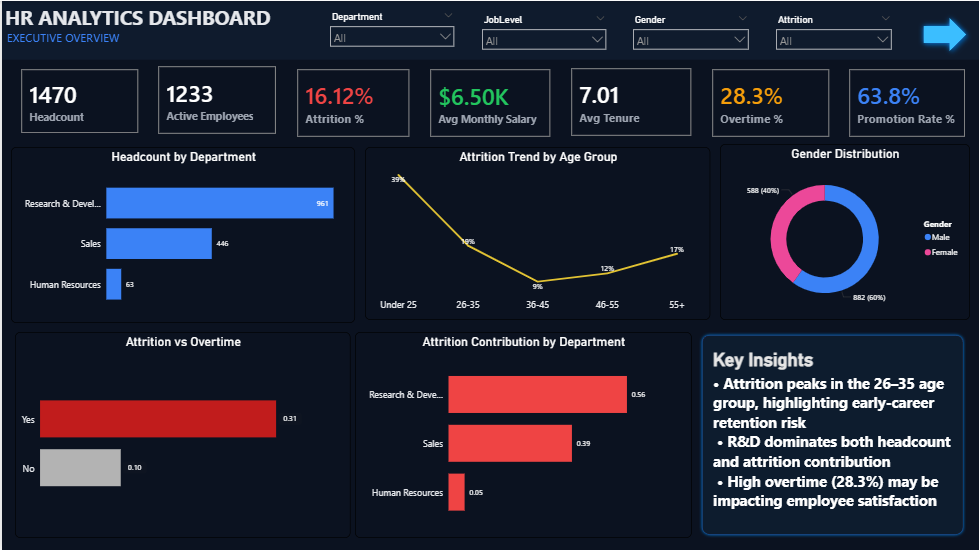
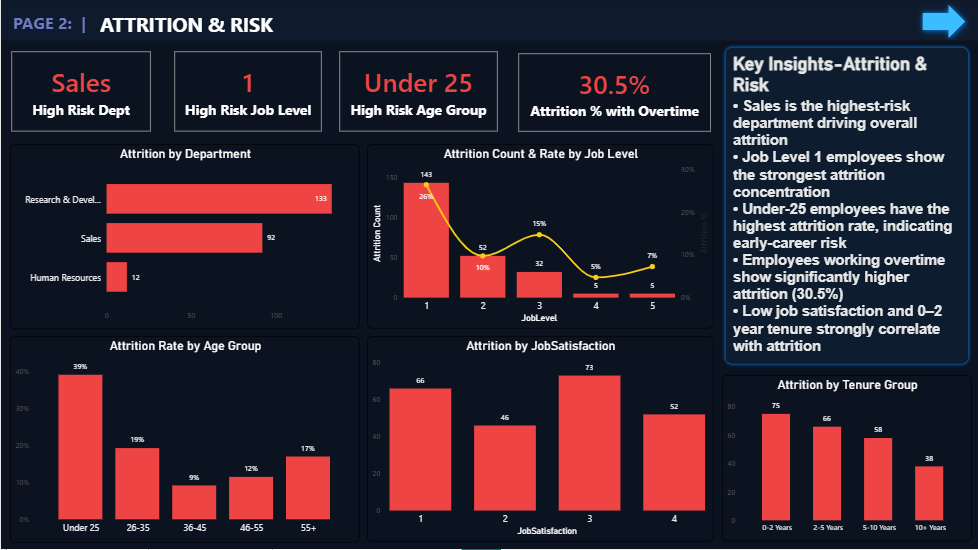
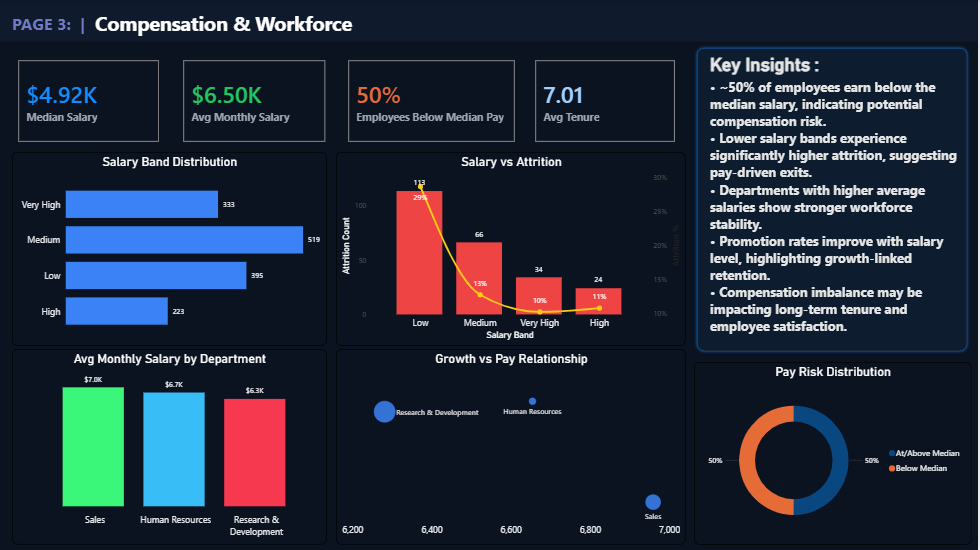

# 📊 HR Analytics Dashboard (Power BI)

## 🔎 Project Overview
This project presents a professional **3-page HR Analytics Dashboard** built in Power BI to analyze workforce composition, attrition drivers, and compensation risks.

The goal is to transform raw HR data into actionable insights that help HR leaders and management make data-driven decisions.

---

## 🎯 Business Objectives
- Identify high-risk employee segments
- Understand attrition drivers
- Analyze salary distribution & pay risk
- Evaluate promotion and compensation relationships
- Support workforce planning decisions

---

# 🖥️ Dashboard Preview

---

## 1️⃣ Executive Overview

**Highlights:**
- Headcount & Active Employees
- Attrition Rate (%)
- Overtime & Promotion KPIs
- Attrition trend by age group
- Department-level attrition contribution
- Gender distribution

---

## 2️⃣ Attrition & Risk Analysis

**Key Focus Areas:**
- High-risk department, job level & age group
- Attrition by job satisfaction
- Attrition by tenure group
- Overtime impact on attrition
- Risk-driven workforce insights

---

## 3️⃣ Compensation & Workforce

**Compensation Insights:**
- Salary band distribution
- Salary vs attrition relationship
- % Employees below median salary
- Promotion vs pay analysis
- Pay risk distribution (Below vs Above median)

---

## 📊 Key Insights
- Early-career employees show higher attrition risk
- Overtime significantly increases attrition probability
- Lower salary bands experience higher attrition
- Higher average salary departments demonstrate stronger stability
- ~50% of employees fall below the median salary level

---

## 🛠 Tools & Technologies
- Power BI (DAX, Power Query)
- Data Modeling
- Excel (Data Cleaning)
- Data Visualization Best Practices

---

## 📁 Files Included
- Power BI Dashboard (.pbix)
- Dashboard screenshots
  
---

## 👤 Author
Ajay Thakur  
Freelance Data Analyst | Power BI | Excel | SQL  

---

⭐ If you found this project valuable, feel free to star the repository!
